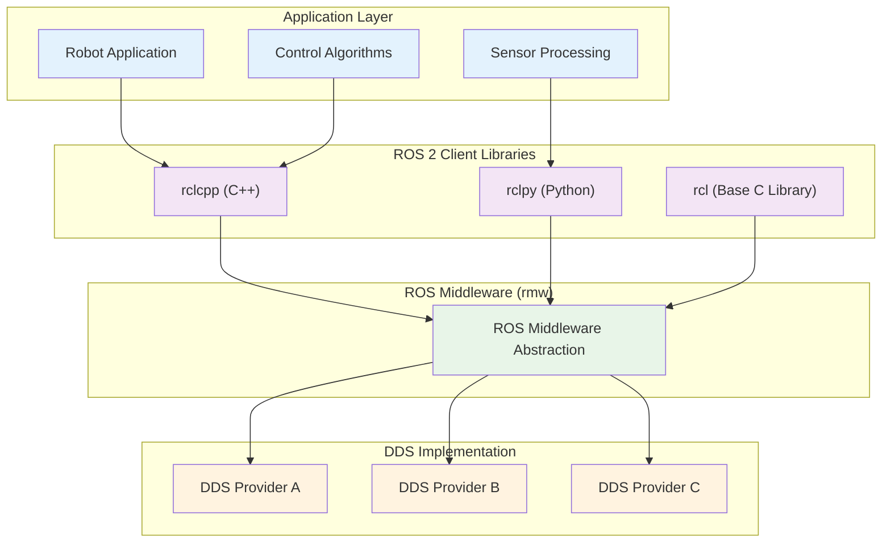
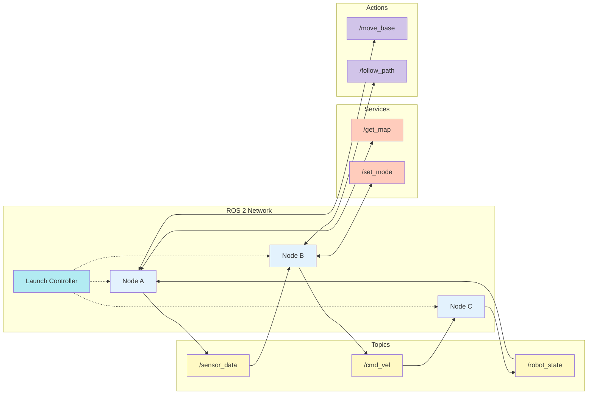
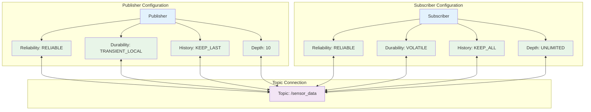
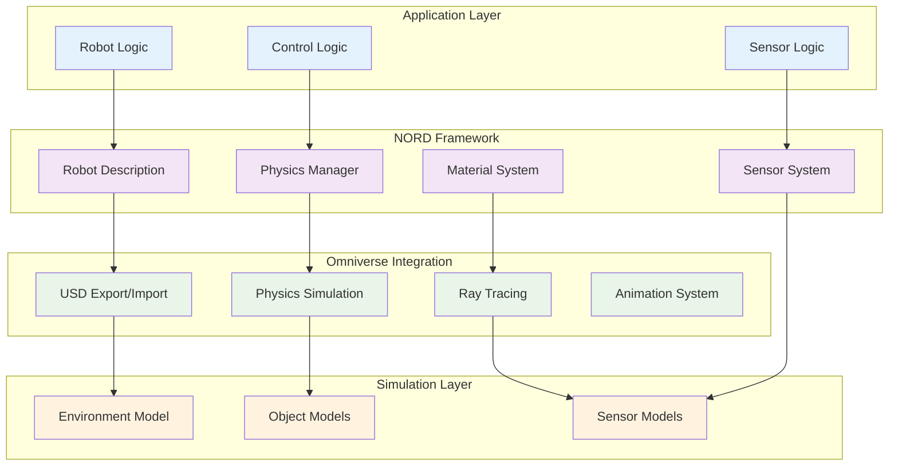
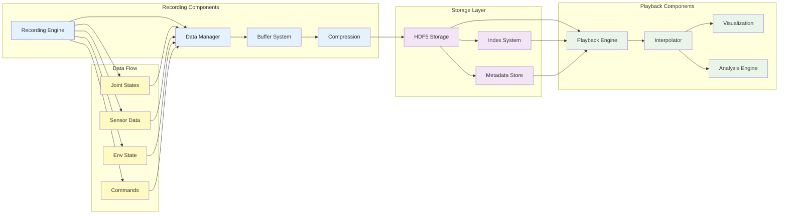
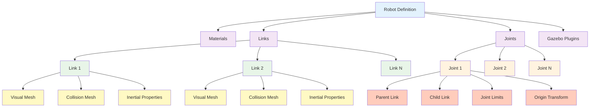
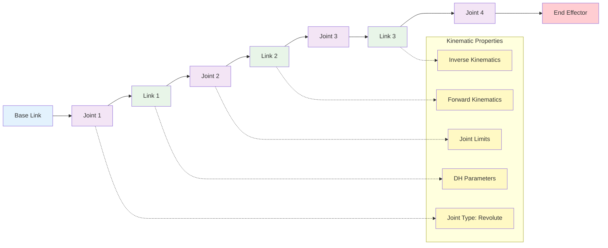
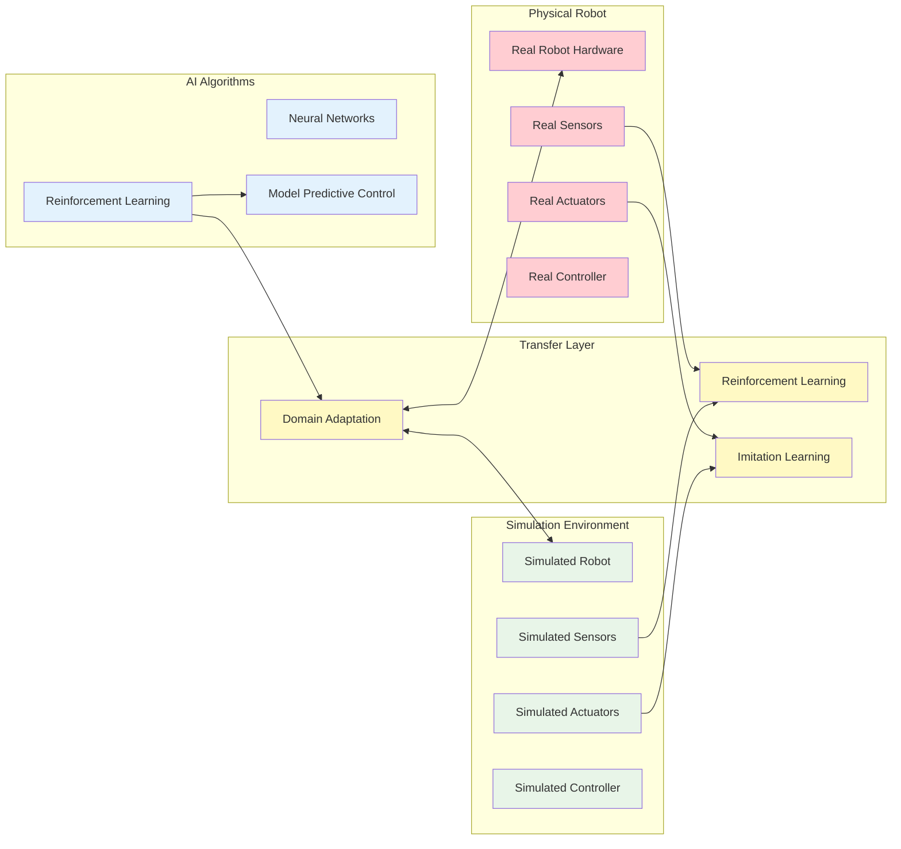
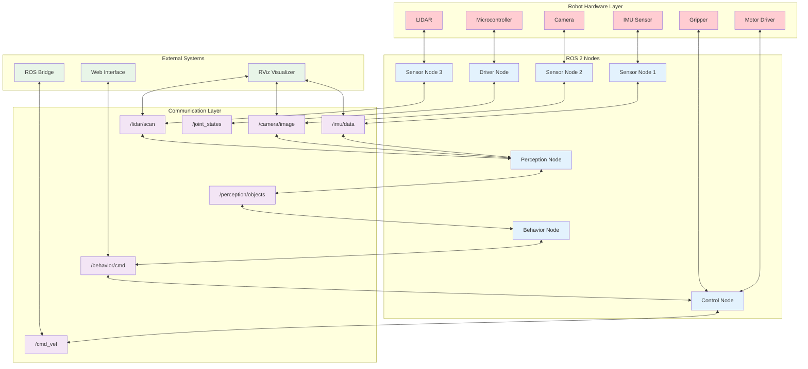

# Module 1 Technical Diagrams: ROS Architecture

## Overview

This section provides technical diagrams illustrating the architecture and concepts of the Robotic Nervous System, focusing on ROS 2 architecture, NORD framework, and system integration patterns. These diagrams visualize the key concepts covered in Module 1.

## ROS 2 Architecture Diagrams

### Client Library Architecture

### Node Communication Pattern

### Quality of Service Configuration

## NORD Framework Architecture

### NORD System Components

### NORD Replay System Architecture

## URDF and Robot Modeling Diagrams

### URDF Structure Hierarchy

### Robot Kinematic Chain

## System Integration Patterns

### Sim-to-Real Transfer Architecture

### Middleware Communication Architecture

These technical diagrams illustrate the core concepts of the Robotic Nervous System, including ROS 2 architecture, NORD framework integration, URDF modeling, and system integration patterns that form the foundation of Physical AI systems.