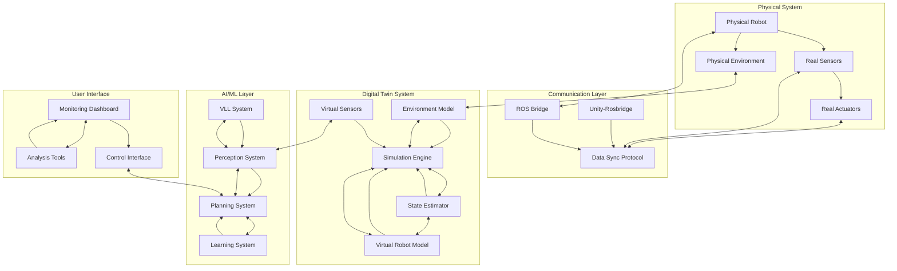
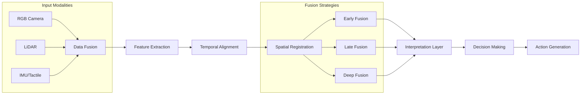
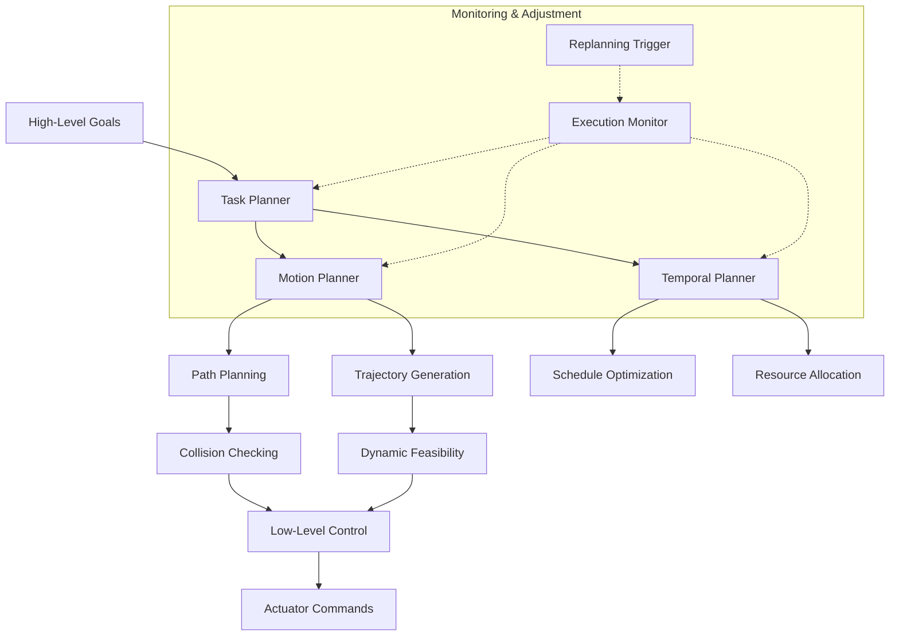
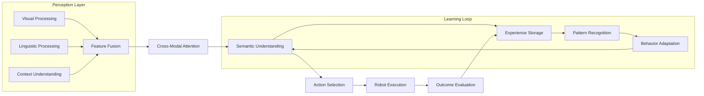
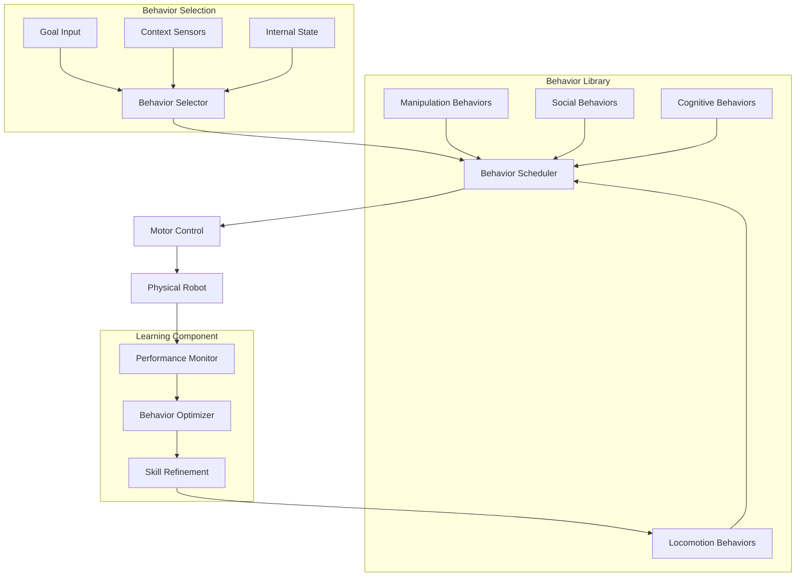
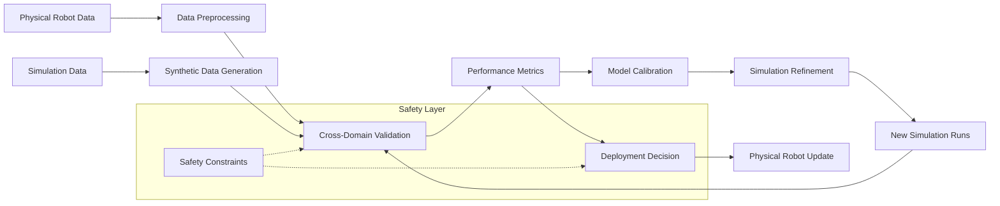

# Digital Twin Architecture: Technical Diagrams

## Overview
This page contains technical diagrams illustrating the architecture and components of digital twin systems for robotics and Physical AI applications.

## Digital Twin System Architecture

## Multimodal Perception Pipeline

## Cognitive Planning Hierarchy

## VLL (Vision-Language-Learning) Integration

## Humanoid Behavior Orchestration

## Digital Twin Validation Pipeline

## Connection to Module 1

The digital twin architecture builds upon the ROS 2 middleware and URDF models established in Module 1. The communication patterns, sensor integration, and robot descriptions from Module 1 provide the foundation for the digital twin system architecture shown above.

These diagrams illustrate how the physical robot (Module 1) connects to its digital representation (Module 2) through various communication and synchronization mechanisms, enabling the advanced capabilities explored in this module.