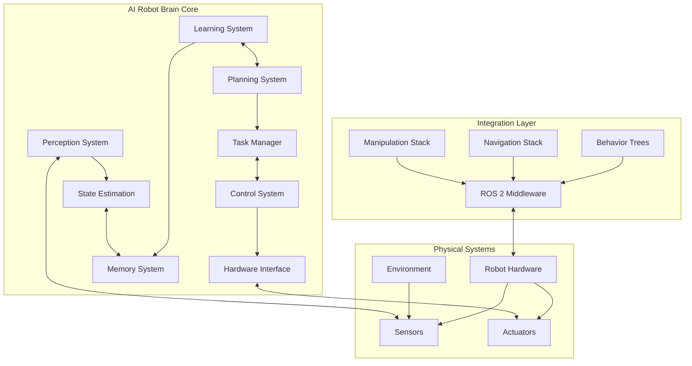
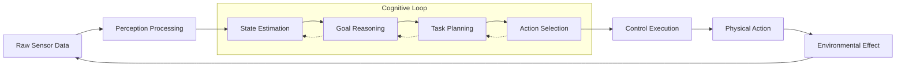
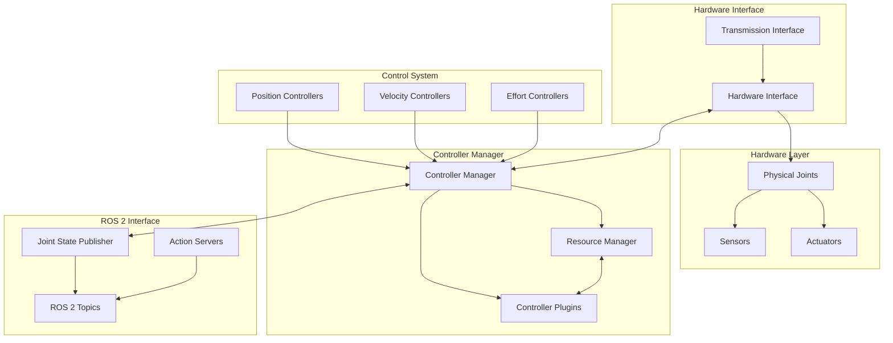
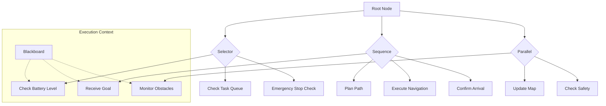
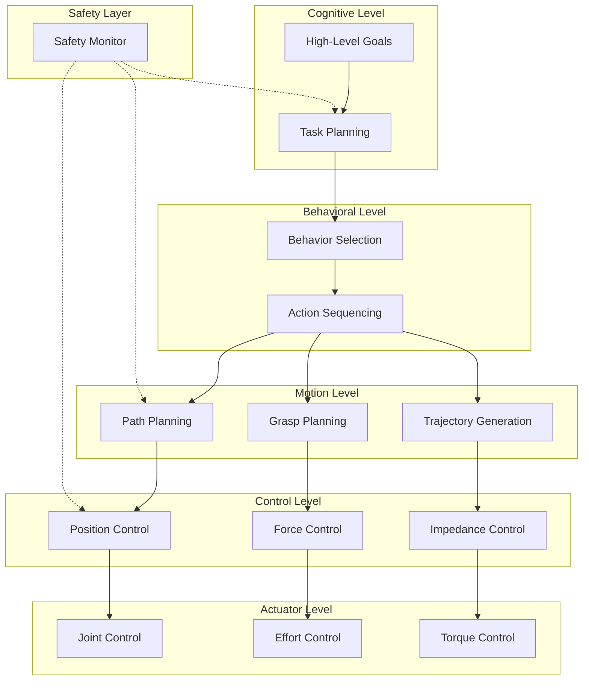
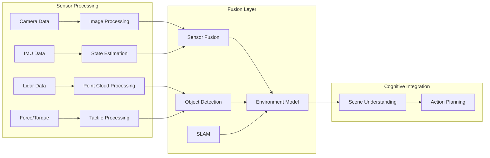
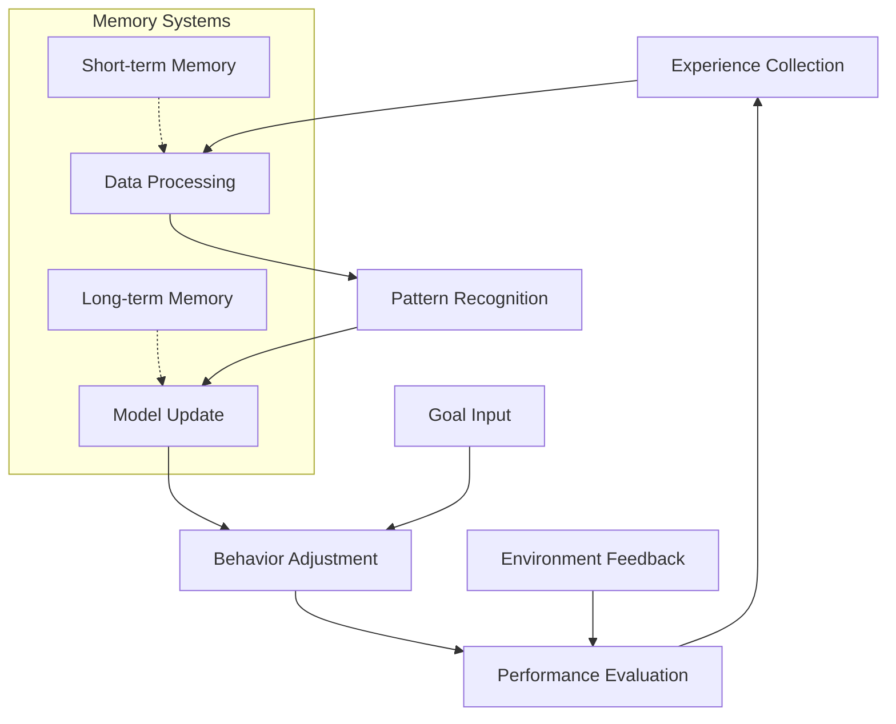
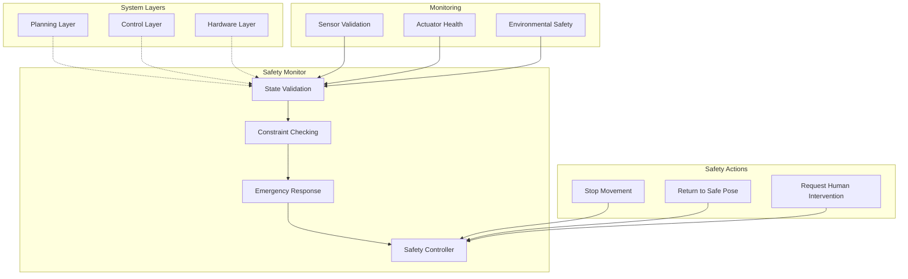
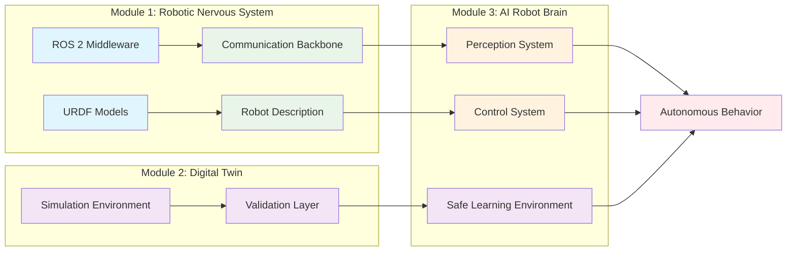

# AI Robot Brain Architecture: Technical Diagrams

## Overview
This page contains technical diagrams illustrating the architecture and components of the AI Robot Brain system, showing how different subsystems integrate to create intelligent robotic behavior.

## AI Robot Brain High-Level Architecture

## Perception-Action Loop

## ros_control Framework Architecture

## Behavior Tree Architecture for Task Planning

## Multi-Level Control Hierarchy

## Perception System Integration

## Learning and Adaptation Loop

## Safety Architecture

## Integration with Previous Modules

These diagrams illustrate how the AI Robot Brain integrates perception, planning, control, and learning systems to create intelligent robotic behavior, building upon the foundations established in Modules 1 and 2.