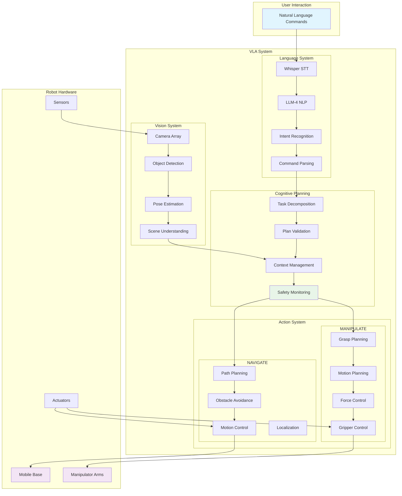
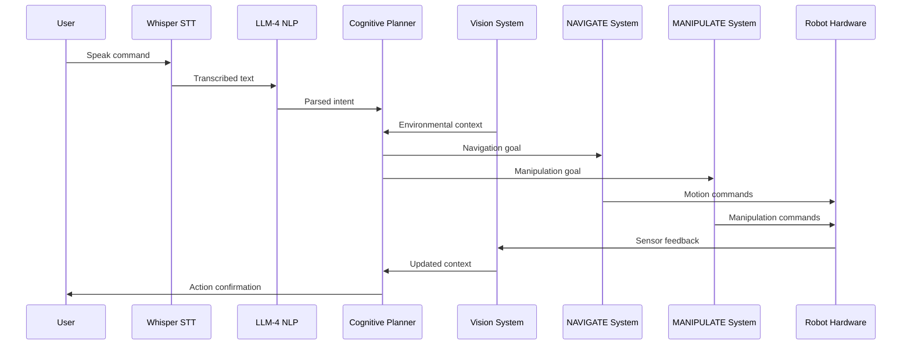
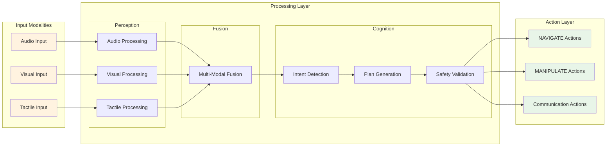
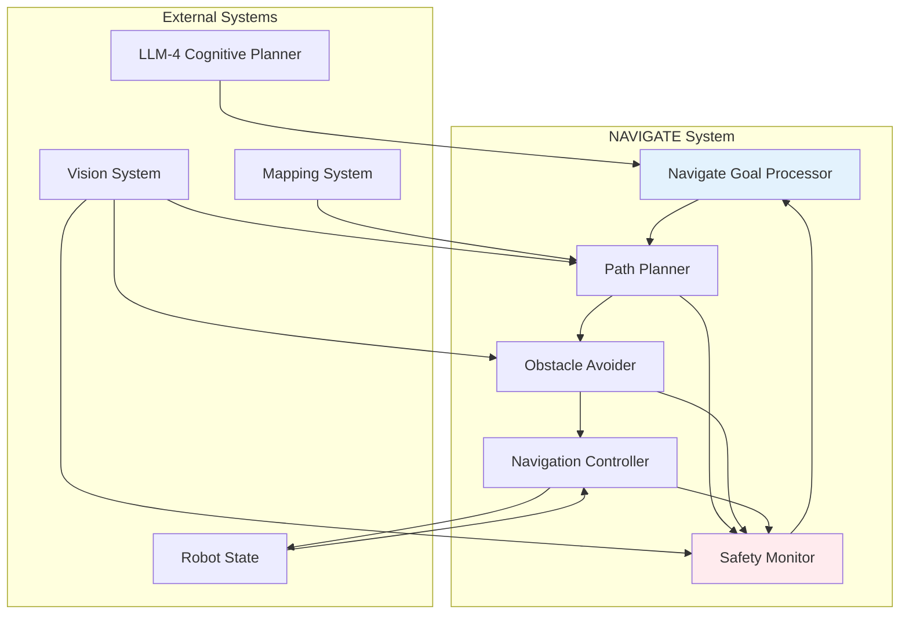
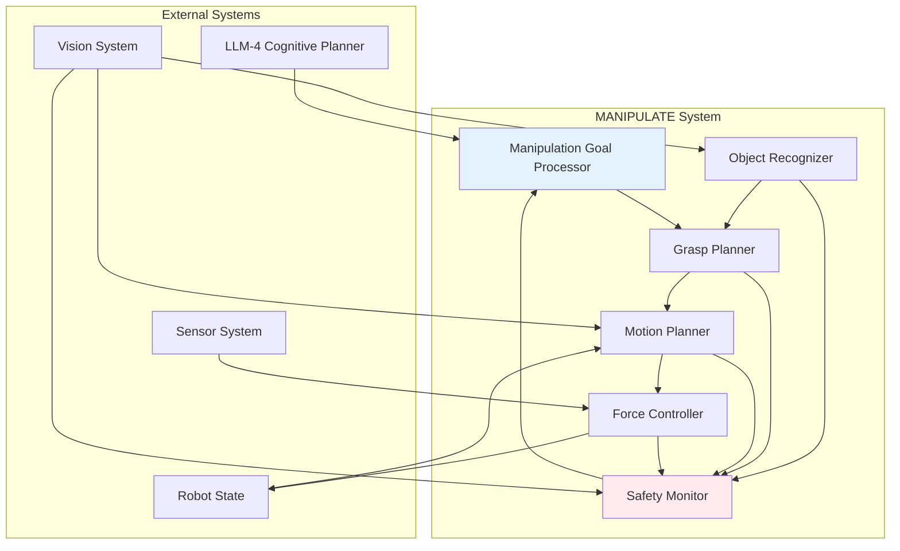
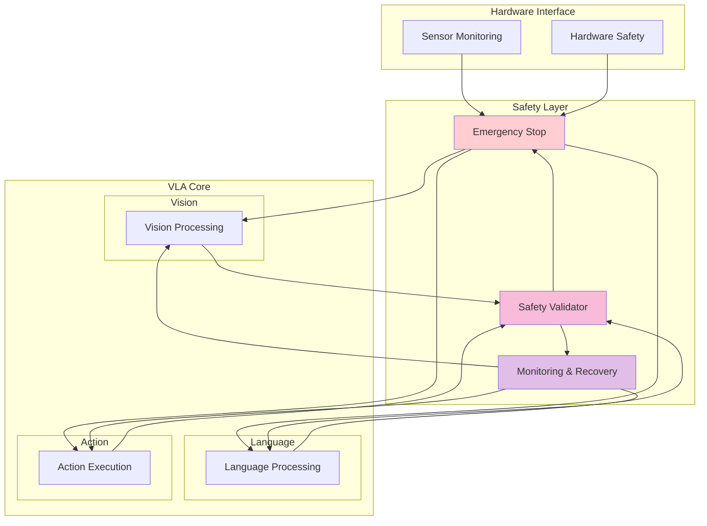
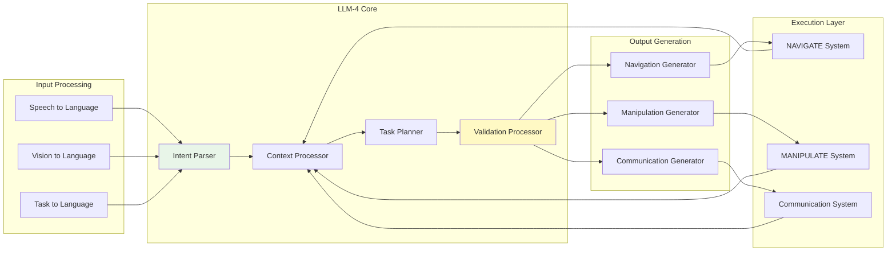
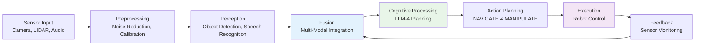
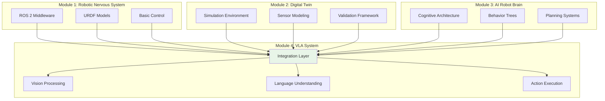

# Technical Diagrams for VLA System Integration

## Overview

This section provides technical diagrams showing the Vision-Language-Action (VLA) system integration, illustrating how the various components work together to create a unified autonomous humanoid robot system. These diagrams visualize the architecture, data flows, and integration patterns that enable the seamless operation of the VLA system.

## System Architecture Diagram

### High-Level VLA Architecture

## Data Flow Diagrams

### Vision-Language-Action Data Flow

### Multi-Modal Integration Flow

## Component Integration Diagrams

### NAVIGATE System Integration

### MANIPULATE System Integration

## Safety Architecture Diagram

### Safety-First VLA Implementation

## Cognitive Planning Integration

### LLM-4 Integration Architecture

## Real-time Processing Pipeline

### VLA System Processing Pipeline

## Module Integration Diagram

### Connection to Previous Modules

These technical diagrams illustrate the comprehensive integration of the Vision-Language-Action system, showing how each component works together to create a unified autonomous humanoid robot system that can perceive, understand, and act in natural human environments.